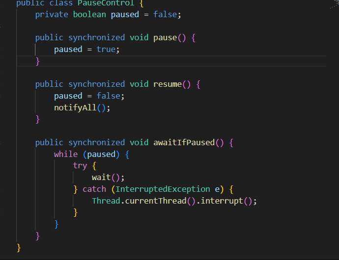

# LAB02 - Arquitectura de Software 2026-1

## Members

- **Nestor David Lopez Castañeda** - [github.com/nestorlop](https://github.com/nestorlop)
---

## Parte I — (Calentamiento) wait/notify en un programa multi-hilo

### Descripción
`PrimeFinder` es una aplicación que busca números primos dentro de un rango dado utilizando múltiples hilos para mejorar el rendimiento.

Cada hilo se encarga de analizar una porción del rango y reportar los números primos encontrados.
 
 ## Solucion
 Para solucionar este problema se decidio crear la clase PauseControl, esta clase tiene como objetivo controlar las pausas de los hilos sin tener que usar thread.sleep esto lo garantizamos usando synchronized el cual garantiza que ningun otro hilo cambie paused 
 
 luego en la clase PrimeFinderThread vamos a agregar el control.awaitIfPaused para que cada hilo vaya revisando si debe pausarse 
 y finalmente modificamos la clase control haciendo que arranque los hilos y luego de t ms se pause muestre los primos, espere y se reanude
## Parte 2 – Control de concurrencia y pausa del juego

Para la Parte 2 se analizó el comportamiento concurrente de las clases
SnakeRunner y GameClock, ya que ambas coordinan la ejecución de múltiples
hilos dentro del juego.

Cada instancia de SnakeRunner se ejecuta en su propio hilo y es responsable
del movimiento de una serpiente. Para permitir la pausa y reanudación del
juego de forma global, se añadió una referencia compartida a GameClock.

Dentro del método run() de SnakeRunner se incorporó la llamada:
java
clock.awaitIfPaused(); 
    .png)Primero tenemos que agregar el clock y en el constructor agregando en el run el clock.awaitIfPaused. Esto se consigue modificando la clase GameClock
    .png)
    En esta clase creamos el metodo usado antes y vamos a hacer que este metodo que garantiza que los hilos se corran en simultaneo, esto es gracias al synchronized que nos va a garantizar que todos los hilos se pausen
 
 
---